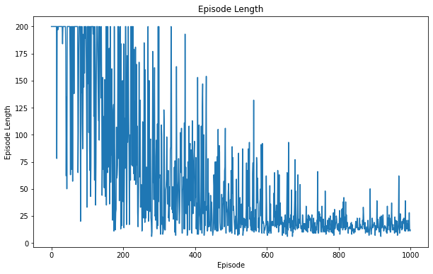

# Reinforcement Learning

## Our methodology to solve the Taxi-v3 environment from gym

>To solve the TAXI DRIVER, we used different algorithms and then compared the metrics of each one.

>This benchmark between different ways for solving the environment allowed us to chose the best implementation in terms of training duration, success rate, episodes length, error & reward evolutions. 

>We also used the gym wrappers to capture a video of our agent. Thus, we could witness the final render.

>The main difficulty for this project was to tune several hyperparameters in order to get the best performance.

>We also developed a module system for each implementation so that we could train our agent with a single command line with varying parameters.

The algorithms used are:
- Q-Learning
- Deep Q-Learning
- SARSA

All the algorithms we will introduced here are based on the **Bellman equation**: 
$$Q(s, a) = r + \gamma \max_{a'} Q(s', a')$$ 
This equation is fundamental in reinforcement learning. 
It is composed of several elements: 
- Q(s, a) is the Q-value for state s and action a. 
- r is the reward received for taking action a in state s and transitioning to state s'. 
- γ is a discount factor that determines how much weight is given to future rewards. 
- max_a Q(s', a') is the maximum Q-value for state s' and all possible actions a'.

In this documentation, you will find some commands to execute the scripts we created to train and evaluate our agents.

[Please check the documentation for the parameters we fine tuned](#hyperparameters)

### Q-Learning

We could not push our Q_tables to this github repository because the files were too large.

[Please find our Q_tables on google drive.](https://drive.google.com/drive/folders/1YozOqLyxeWMI0enCEp-ImXAoIhpHbpUc?usp=drive_link)

Note that the one named "success" is the one with the largest success rate (around 100%).

Other files in this google drive correspond to several attempts named after their success rate.

Command to train the Q-Learning agent specifying all the necessary hyperparameters (root : Taxi-Project/QLearning):
```
python3 train.py -env Taxi-v3 -g 0.95 -lr 0.01 -es 1.0 -ee 0.1 -n 10_000 -model q_table
```

Command to evaluate our Q-Table (root : Taxi-Project/QLearning):
```
python3 evaluation.py -env Taxi-v3 -model q_table -video visual_inspect_q_table
```

Here are some plots to describe what happened during our Q-Learning training in terms of episodes duration, error & reward evolution.

|  |
|:--:| 
| *Minimal epsilon: 0.1 / Learning Rate: 0.001 / Gamma: 0.5 / Number of episodes: 50_000 / Success rate : 2%* |

|  |
|:--:| 
| *Minimal epsilon: 0.2 / Learning Rate: 0.01 / Gamma: 0.8 / Number of episodes: 50_000 / Success rate : 90%* |

|  |
|:--:| 
| *Minimal epsilon: 0.2 / Learning Rate: 0.01 / Gamma: 0.7 / Number of episodes: 55_000 / Success rate : 85%* |

|  |
|:--:| 
| *Minimal epsilon: 0.3 / Learning Rate: 0.01 / Gamma: 0.8 / Number of episodes: 60_000 / Success rate : 98%* |

We can see that our last attempt gave us the best results (98% success rate). 
Some evaluations (`evaluation.py`) give 100% success rate but that is not always the case (90%-100%).
We should find a way to get better hyperparameters to reach 100% on every run.

### Deep Q-Learning

We could not push our weights for the Deep Q Neural Network to this github repository because the files were too large.

[Please find our weights on google drive.](https://drive.google.com/drive/folders/1tRamore0Xi6iRyd5mnrzkn1UXOTiYFzY?usp=drive_link)

Note that the one named "success" is the one with the 100% success rate.

Other files in this google drive correspond to several attempts named after their success rate.

Command to train the DQN agent specifying all the necessary hyperparameters (root : Taxi-Project/DeepQLearning):
```
python3 train.py -env Taxi-v3 -g 0.7 -es 1.0 -ee 0.3 -ed 5e-6 -lr 0.001 -n 50_000 -bs 512 -l1 512 -l2 256 -model model
```

Command to evaluate our model (root : Taxi-Project/DeepQLearning):
```
python3 evaluation.py -env Taxi-v3 -l1 512 -l2 256 -model model -video visual_inspect_deep_q
```
The Deep Q-Learning implementation is probably the one that took us longer.

We struggled to find a good combination of the hyperparameters but it was worth it since we ended up with a 100% success rate !

We started our research with a .9 discount rate and a batch size of 64 for the replay memory. 
We were not getting good results : only 5% success rate for a training over 10_000 episodes and the average reward for an episode quickly stucked to -200.

The key thing here was to descrease de discount factor to .7 and increase the replay memory size.

This way, our agent could value more future rewards and tune itself with more past experiences.

We also played with the Deep Neural Network structured layers in order to get the best results.

Here are some plots for our different attempts, representing the evolution of epsilon and rewards over the episodes.

|  |
|:--:| 
| *Epsilon decay: 5e-7x1.3 / Learning Rate: 0.001 / Gamma: 0.6 / Number of episodes: 30_000 / Replay size: 256* |

|  |
|:--:| 
| *Epsilon decay: 5e-7x1.2 / Learning Rate: 0.001 / Gamma: 0.5 / Number of episodes: 10_000 / Replay size: 512* |

|  |
|:--:| 
| *Epsilon decay: 5e-7x2 / Learning Rate: 0.001 / Gamma: 0.6 / Number of episodes: 15_000 / Replay size: 256* |

**Successful attempt**
|  |
|:--:| 
| *Epsilon decay: 5e-6 / Learning Rate: 0.001 / Gamma: 0.7 / Number of episodes: 50_000 / Replay size: 256* |

**This approach gave us a good Deep Q Network model (100% success rate).**

We may need to adjust it: for instance, we notice on the plot that we could have stopped training around the 30_000th episode since it was already converging.

### SARSA
- SARSA is an on-policy TD control algorithm. It uses the same action-value function as Q-Learning, but it updates the action-value function based on the action taken by the policy that is being learned. This means that the action-value function is updated based on the action that was taken and the action that is expected to be taken by the policy that is being learned. This is different from Q-Learning, which updates the action-value function based on the action that was taken and the action that maximizes the action-value function for the next state.
- Here are metrics for this resolution of the environment.

**Time-Limited Mode**
| *Epsilon: 0.1  / Learning Rate: 0.2 / convergence_threshold: 0.1 / Number of episodes: 5_500* |

|  |
|:--------------------------------------------------------------------:| 
|                         *Rewards over time*                          |

|  |
|:------------------------------------------------------:| 
|               *Episode Length over time*               |

|  |
|:----------------------------------------------------:| 
|                  *Errors over time*                  |

|  |
|:----------------------------------------------------------------:| 
|                          *Convergence*                           |

| *Convergence achieved at episode: 3900 / Success rate: 100%* |

Optimal solution.


**User Mode**

| *Epsilon: 0.1  / Learning Rate: 0.2 / convergence_threshold: 0.1 / Number of episodes: 1000* |

|  |
|:---------------------------------------------------------------------:| 
|                          *Rewards over time*                          |

|  |
|:-------------------------------------------------------------------:| 
|                     *Episode Length over time*                      |

|  |
|:-----------------------------------------------------------------:| 
|                        *Errors over time*                         |

|  |
|:-----------------------------------------------------------------------------:| 
|                                 *Convergence*                                 |

| *No convergence found  / Success rate: 75%* |

In comparison to the first set, which required 5500 episodes, had a longer training time before achieving convergence (at episode 3900) with a 100% success rate. In contrast, the second set only required 1000 episodes but did not achieve convergence, and its success rate was 75%. This suggests that the first set of parameters and its longer training time led to a more successful and stable learning outcome compared to the second set with a shorter training duration.

| *Epsilon: 0.1  / Learning Rate: 0.5 / convergence_threshold: 0.1 / Number of episodes: 10 000* |

|  |
|:--------------------------------------------------------------------:| 
|                         *Rewards over time*                          |

|  |
|:------------------------------------------------------------------:| 
|                     *Episode Length over time*                     |

|  |
|:----------------------------------------------------------------:| 
|                        *Errors over time*                        |

|  |
|:----------------------------------------------------------------------------:| 
|                                *Convergence*                                 |

| *No convergence found  / Success rate: 64%* |

In this case, using the SARSA algorithm with an epsilon of 0.1, a higher learning rate of 0.5, and a convergence threshold of 0.1, the training process ran for a significantly larger number of episodes (10,000). However, despite the extensive training, no convergence was achieved, and the success rate remained at 64%. This suggests that the combination of a high learning rate and longer training did not lead to convergence and resulted in a lower success rate compared to the previous parameter sets.


| *Epsilon: 0.5  / Learning Rate: 0.2 / convergence_threshold: 0.1 / Number of episodes: 5500* |

|  |
|:-------------------------------------------------------------------------:| 
|                            *Rewards over time*                            |

|  |
|:-----------------------------------------------------------------------:| 
|                       *Episode Length over time*                        |

|  |
|:----------------------------------------------------------------:| 
|                        *Errors over time*                        |

|  |
|:----------------------------------------------------------------------------:| 
|                                *Convergence*                                 |

| *No convergence found  / Success rate: 92%* |

With an epsilon of 0.5, a learning rate of 0.2, a convergence threshold of 0.1, and a total of 5500 episodes, the SARSA algorithm did not achieve convergence, but it exhibited a high success rate of 92%. This indicates that the agent performed well in the environment, achieving the desired task in the majority of episodes, but it may not have found an optimal policy or the best solution within the specified convergence criteria. Further investigation is needed to determine if additional training or adjustments to the parameters are necessary for better convergence.
| *Epsilon: 0.1  / Learning Rate: 0.1 / convergence_threshold: 0.1 / Number of episodes: 2000* |

|  |
|:----------------------------------------------------------------------:| 
|                          *Rewards over time*                           |

|  |
|:------------------------------------------------------------------:| 
|                     *Episode Length over time*                     |

|  |
|:------------------------------------------------------------------:| 
|                         *Errors over time*                         |

|  |
|:----------------------------------------------------------------------------:| 
|                                *Convergence*                                 |

| *Convergence achieved at episode: 1100 / Success rate: 84%* |

The parameter set with an epsilon of 0.1, a learning rate of 0.1, a convergence threshold of 0.1, and a total of 2000 episodes achieved convergence at episode 1100 with an 84% success rate. Despite reaching convergence and having a relatively high success rate, it's important to thoroughly evaluate the agent's performance to ensure its behavior is effective and reliable in all scenarios within the Taxi environment, as there might be room for improvement or limitations in its learned policy.

## Wrapping up

The taxi environment is a partially observable environment, which means that the agent does not have perfect information about the state of the environment. This makes it more challenging to solve than a fully observable environment. 
However, Q-learning is able to handle partially observable environments by storing a table of Q-values, which represent the expected reward for taking a particular action in a particular state. 
The agent updates the Q-values as it interacts with the environment, and eventually learns the optimal policy.

In our case Q-Learning was quite fast to converge and we got a good success rate using this algorithm.

On the other hand, Deep Q-Learning, which is a variant of Q-Learning including neural networks, was much slower but gave us 100% success rate in the end.

SARSA just slight differs from Q-Learning because it takes into account the future states and actions to updates the Q table.

We can conclude that all of the three algorithms provide us good results. 
Nonetheless, Q-Learning seems the go-to solution for this environment in terms of training time.

## Hyperparameters

| shortcut | long | description |
|---|---|---|
| env | environment | Name of the gym environment to load |
| g | gamma | Discount factor |
| lr | learning-rate | Learning Rate |
| es | epsilon-start | Starting value for epsilon |
| ee | epsilon-end | Minmum value for epsilon |
| ed | epsilon-decay | How fast epsilon descreases |
| n | n-episodes | Number of episodes to play to train the agent |
| model | model-name | Name of the model / Q-table to save or to load |
| video | prefix-video | Name of the rendered video for visual inspection of the agent's behaviour |
| bs | batch-size | Size of the replay memory in Deep Q-Learning |
| l1 | layer-one | Size of the first layer of the Deep Q Model |
| l2 | layer-two | Size of the second layer of the Deep Q Model |
---

***NB:** In the `BOOTSTRAP` folder of this repository, you will also find our first work on reinforcement learning, using the Frozen Lake environment from gym.*
